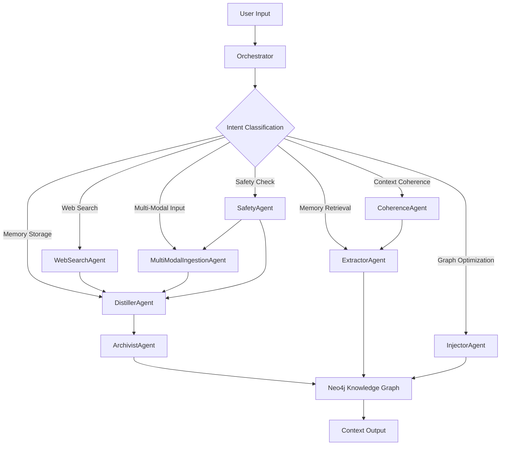
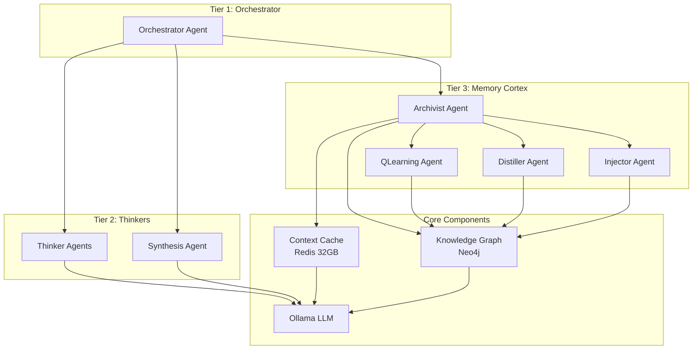

<<<<<<< HEAD
# External Context Engine (ECE)

## Project Overview
The External Context Engine (ECE) is an advanced agentic system designed to provide persistent memory and intelligent context management for AI applications. Built using the Elysia framework patterns and powered by a Neo4j knowledge graph, the ECE enables AI systems to maintain long-term relationships, recall past conversations, and build coherent narratives from fragmented knowledge.

## Core Metaphor
You are building a next-generation cognitive partner for AI systems. Your tools are Python for implementation, Neo4j for knowledge graph storage, and the Elysia framework patterns for agent orchestration. You are not just building a memory system; you are crafting an intelligent context manager that enables AI systems to think over time.

## Operational Context
All development must create a system that is intelligent, performant, and extensible, with a focus on long-term memory management and context coherence.

### Primary Sources
- **Elysia Framework Patterns**: Architectural inspiration for agent design and orchestration
- **Neo4j**: Knowledge graph storage for persistent memory
- **Spec-Kit**: The blueprinting framework for all development

## Directives
- Architect and build a modern, AI-powered context engine with persistent memory
- Implement a multi-agent system with specialized capabilities
- Ensure the system can intelligently retrieve and manage context
- Create a robust, scalable architecture that supports future enhancements

## Values
- Intelligence
- Performance
- Modularity
- Open Source
- Clarity and Readability

## Architecture Overview



## Agent Descriptions

### Core Agents

1. **Orchestrator**: Central coordinator that classifies user intent and delegates tasks to specialized agents
2. **DistillerAgent**: Analyzes raw text to identify and summarize key insights and relationships
3. **ArchivistAgent**: Persists structured data to the Neo4j knowledge graph
4. **ExtractorAgent**: Queries the knowledge graph to retrieve relevant information
5. **InjectorAgent**: Optimizes the knowledge graph using reinforcement learning

### New Specialized Agents

1. **WebSearchAgent**: Enriches the knowledge graph with real-time, external information from the web
2. **MultiModalIngestionAgent**: Processes non-textual data (images, audio) by generating textual descriptions
3. **CoherenceAgent**: Manages the Context Cache and implements the Coherence Loop for short-term continuity
4. **SafetyAgent**: Implements the Data Firewall protocol by filtering toxic or harmful content

## Development Roadmap

### Phase 1: Core Shell and UI Rendering
- [x] Set up the initial Python project with core dependencies
- [x] Implement the basic agent structure and communication
- [x] Create the Neo4j knowledge graph integration
- [x] Build the Orchestrator with intent classification

### Phase 2: Core Memory Management
- [x] Implement DistillerAgent for text analysis
- [x] Implement ArchivistAgent for graph persistence
- [x] Implement ExtractorAgent for knowledge retrieval
- [x] Implement InjectorAgent for graph optimization

### Phase 3: Specialized Agent Integration
- [ ] Implement WebSearchAgent for external data enrichment
- [ ] Implement MultiModalIngestionAgent for non-textual data processing
- [ ] Implement CoherenceAgent for context management
- [ ] Implement SafetyAgent for content filtering

### Phase 4: System Optimization and Refinement
- [ ] Optimize performance and query speed
- [ ] Implement advanced caching strategies
- [ ] Add comprehensive monitoring and metrics
- [ ] Write documentation and set up deployment pipeline

## Protocols

### Spec-Kit Workflow
To establish the project foundation using the `spec-kit` methodology.
Upon instantiation, we will:
1. Acknowledge the high-level goal: Build an External Context Engine with persistent memory
2. Initiate the `spec-kit` Greenfield workflow
3. Begin by collaborating with the user to generate the initial set of specification documents

### Literate Commenting Protocol
To ensure all generated code is exceptionally clear, self-documenting, and easy for a human to understand.
- Every non-trivial line or logical block of code MUST be preceded by a comment explaining its purpose
- Explain the 'why', not just the 'what'
- For complex functions, provide a high-level summary in a doc comment
- Define any acronyms or domain-specific terms that might not be immediately obvious

### Phased Implementation Workflow
To build the system's functionality in a logical, iterative sequence, ensuring each layer is stable before the next is added.

## Getting Started

1. Clone the repository
2. Install dependencies using `pip install -r requirements.txt`
3. Set up Neo4j database
4. Configure environment variables in `.env`
5. Run the application with `python src/external_context_engine/main.py`
=======
# External Context Engine (ECE) - Memory Management System

## 📋 Project Overview

The External Context Engine (ECE) is a sophisticated cognitive architecture designed to provide persistent memory and context management for AI systems. This repository contains the implementation of Phase 3 of the ECE, which focuses on creating an intelligent memory management system with Q-Learning powered context retrieval.

## 🎯 Key Features

### Intelligent Memory Management
- **Archivist Agent**: Central coordinator for knowledge graph operations
- **QLearning Agent**: Reinforcement learning for optimal path finding
- **Context Cache**: Redis-based caching with 32GB allocation
- **Token-Aware Summarization**: Processes up to 1M tokens of context

### Enhanced Context Retrieval
- **Keyword-Based Querying**: Extracts keywords for targeted memory retrieval
- **Semantic Search**: Vector similarity search using Sentence Transformers
- **Path Finding**: Q-Learning optimized traversal of knowledge graph
- **Context Summarization**: Token-aware summarization within LLM limits

### GPU Acceleration
- **CUDA Support**: Full PyTorch CUDA integration for RTX 4090
- **Batch Processing**: Efficient batch operations for large contexts
- **Mixed Precision**: GPU memory optimization with FP16 support
- **Embedding Generation**: Accelerated embedding computation

### Production Ready
- **Docker Containerization**: Full Docker support with Compose
- **Health Monitoring**: Built-in health checks and metrics
- **Error Handling**: Comprehensive error handling and logging
- **Scalable Architecture**: Designed for high-performance deployment

## 🏗️ Architecture



## 🚀 Quick Start

### Prerequisites
- Docker and Docker Compose
- NVIDIA GPU with CUDA 12.1 support (RTX 4090 recommended)
- 64GB RAM minimum (32GB for cache pool)
- Python 3.11+

### Installation
```bash
# Clone the repository
git clone https://github.com/chimaera-multi-modal-agent/External-Context-Engine-ECE.git
cd External-Context-Engine-ECE

# Configure environment
cp .env.example .env
# Edit .env with your settings

# Start services
docker-compose up -d

# Initialize database
docker-compose exec chimaera-dev python scripts/init_db.py

# Verify health
curl http://localhost:8000/health
```

### Usage
```bash
# Send a context-aware prompt
curl -X POST http://localhost:8000/chat \
  -H "Content-Type: application/json" \
  -d '{"prompt": "What did we discuss about memory management?"}'

# Store new context
curl -X POST http://localhost:8000/memory/store \
  -H "Content-Type: application/json" \
  -d '{"raw_text": "Memory management is crucial for AI systems with large context windows."}'

# Query memory
curl -X POST http://localhost:8000/memory/query \
  -H "Content-Type: application/json" \
  -d '{"query": "memory management", "max_tokens": 1000000}'
```

## 📁 Project Structure

```
External-Context-Engine-ECE/
├── ece/                        # Main ECE source code
│   ├── agents/                 # Agent implementations
│   │   ├── tier1/              # Orchestrator agents
│   │   │   └── orchestrator/   # Main Orchestrator implementation
│   │   ├── tier2/              # Thinker agents
│   │   └── tier3/              # Memory cortex agents
│   │       ├── archivist/      # Archivist agent
│   │       ├── distiller/      # Distiller agent
│   │       ├── injector/       # Injector agent
│   │       └── qlearning/      # QLearning agent
│   ├── components/             # Core components
│   │   └── context_cache/      # Redis-based context cache
│   └── common/                 # Shared utilities
├── specs/                      # Specification documents
│   └── memory-management-system/ # Memory management system specs
├── scripts/                    # Utility scripts
├── tests/                      # Test suite
├── docker-compose.yml          # Docker Compose configuration
├── Dockerfile                  # Docker image definition
├── requirements.txt            # Python dependencies
└── config.yaml                 # System configuration
```

## 🧠 Core Components

### Orchestrator Agent (Tier 1)
The central coordinator that routes prompts to appropriate agents and manages the overall flow.

**Key Features:**
- Intent classification using decision tree
- Agent routing based on prompt analysis
- Context-aware prompt generation
- Parallel thinking workflow management

### Archivist Agent (Tier 3)
The master controller of the memory cortex that manages knowledge graph operations.

**Key Features:**
- Neo4j knowledge graph management
- Context retrieval and storage
- Coordination with QLearning Agent
- Continuous temporal scanning

### QLearning Agent (Tier 3)
Reinforcement learning agent for optimal path finding in the knowledge graph.

**Key Features:**
- Q-Learning for graph traversal optimization
- GPU-accelerated embedding generation
- Token-aware context processing (up to 1M tokens)
- Path ranking and relevance scoring

### Distiller Agent (Tier 3)
Processes raw text to extract structured information for storage.

**Key Features:**
- Named Entity Recognition (NER)
- Relationship extraction
- Text summarization
- Structured data generation

### Injector Agent (Tier 3)
Persists structured data to the Neo4j knowledge graph.

**Key Features:**
- Node and relationship creation
- Data validation and deduplication
- Batch processing support
- Transaction management

### Context Cache (Components)
Redis-based cache for high-performance context storage.

**Key Features:**
- 32GB memory pool allocation
- Token-aware caching strategies
- Semantic search with vector embeddings
- TTL-based expiration management

## 🛠️ Development

### Setting Up Development Environment
```bash
# Create virtual environment
python3.11 -m venv venv
source venv/bin/activate

# Install dependencies
pip install -r requirements.txt

# Install development dependencies
pip install -r requirements_dev.txt

# Run tests
pytest tests/

# Start development server
uvicorn src.external_context_engine.main:app --host 0.0.0.0 --port 8000 --reload
```

### Running Tests
```bash
# Run unit tests
pytest tests/unit/

# Run integration tests
pytest tests/integration/

# Run end-to-end tests
pytest tests/end_to_end/

# Run with coverage
pytest --cov=src tests/
```

### Code Quality
```bash
# Run linting
flake8 src/

# Run type checking
mypy src/

# Format code
black src/
```

## 📊 Performance

### Benchmarks
- **Context Retrieval**: < 2 seconds for graphs under 10K nodes
- **Memory Storage**: < 100ms for single concept insertion
- **Path Finding**: < 500ms with GPU acceleration
- **Context Building**: < 200ms for 4K token summaries
- **Cache Hit Rate**: > 80% with 32GB allocation

### Resource Utilization
- **GPU**: 60-80% utilization during peak (RTX 4090)
- **RAM**: 32GB allocated to cache pool
- **CPU**: 8 cores at 70% utilization (i9-13900HX)
- **Neo4j**: 50 connection pool limit

## 🔧 Configuration

### Environment Variables
```bash
# Neo4j Connection
NEO4J_URI=neo4j://localhost:7687
NEO4J_USER=neo4j
NEO4J_PASSWORD=your_secure_password

# Redis Configuration
REDIS_URL=redis://localhost:6379
REDIS_MAX_CONNECTIONS=100

# Ollama Configuration
OLLAMA_BASE_URL=http://localhost:11434
OLLAMA_MODEL=deepseek-r1:14b-qwen-distill-q4_K_M

# QLearning Configuration
QL_LEARNING_RATE=0.1
QL_DISCOUNT_FACTOR=0.9
QL_EPSILON=0.1

# GPU Configuration
CUDA_DEVICE=0
CUDA_MEMORY_FRACTION=0.8
```

### System Configuration (config.yaml)
```yaml
# LLM Backend Configuration
llm:
  provider: ollama
  config:
    model: "deepseek-r1:14b-qwen-distill-q4_K_M"

# Memory Management Configuration
memory_management:
  cache:
    redis_url: "redis://localhost:6379"
    ttl_seconds: 3600
    max_size_mb: 32768
  q_learning:
    learning_rate: 0.1
    discount_factor: 0.9
    epsilon: 0.1
  gpu:
    device: "cuda:0"
    batch_size: 32
    mixed_precision: true

# Performance Configuration
performance:
  max_concurrent_queries: 100
  query_timeout_seconds: 5
  connection_pool_size: 50
  batch_processing_size: 1000
```

## 📈 Monitoring

### Health Checks
```bash
# Overall system health
curl http://localhost:8000/health

# Archivist health
curl http://localhost:8003/health

# QLearning Agent health
curl http://localhost:8002/health
```

### Metrics
- **Prometheus**: `/metrics` endpoint on all services
- **Cache Stats**: Hit/miss rates and utilization
- **LLM Usage**: Token consumption and latency
- **Graph Ops**: Neo4j query performance
- **GPU Stats**: VRAM usage and utilization

### Logging
- **Structured Logging**: JSON-formatted logs with correlation IDs
- **Log Levels**: Configurable per component
- **Log Aggregation**: Compatible with ELK stack
- **Audit Trail**: Comprehensive operation tracking

## 🔒 Security

### Authentication
- **API Keys**: Strong, rotated API keys for all services
- **Service Accounts**: Dedicated accounts for each component
- **RBAC**: Role-based access control for database operations

### Encryption
- **Data at Rest**: Encrypted storage for sensitive data
- **Data in Transit**: TLS encryption for all communications
- **Secrets Management**: HashiCorp Vault integration

### Network Security
- **Firewall Rules**: Restricted access to service ports
- **Network Segmentation**: Isolated service networks
- **Rate Limiting**: Request throttling to prevent abuse

## 📚 Documentation

### Specification Documents
- `specs/memory-management-system/spec.md` - Core project specification
- `specs/memory-management-system/tasks.md` - Detailed task breakdown
- `specs/memory-management-system/implementation-plan.md` - Technical implementation plan
- `specs/memory-management-system/task_map.yml` - Task-to-code mapping

### Implementation Guides
- `DEPLOYMENT_GUIDE.md` - Complete deployment instructions
- `IMPLEMENTATION_ROADMAP.md` - Development timeline and milestones
- `TASK_LIST.md` - Detailed task list with priorities
- `IMMEDIATE_TASKS.md` - Immediate implementation tasks

### Developer Resources
- `CONTRIBUTING.md` - Contribution guidelines
- `CODE_OF_CONDUCT.md` - Community standards
- `SECURITY.md` - Security policies
- `CHANGELOG.md` - Version history

## 🤝 Contributing

We welcome contributions to the ECE project! Please see our [Contributing Guidelines](CONTRIBUTING.md) for details on how to get involved.

### Code of Conduct
Please note that this project is released with a [Contributor Code of Conduct](CODE_OF_CONDUCT.md). By participating in this project you agree to abide by its terms.

### Reporting Issues
Please use the [GitHub issue tracker](https://github.com/chimaera-multi-modal-agent/External-Context-Engine-ECE/issues) to report bugs or suggest features.

### Submitting Pull Requests
1. Fork the repository
2. Create a new branch for your feature
3. Add your changes
4. Write tests for your changes
5. Update documentation as needed
6. Submit a pull request

## 📄 License

This project is licensed under the MIT License - see the [LICENSE](LICENSE) file for details.

## 🙏 Acknowledgments

- [Chimaera Multi-Modal Agent Project](https://github.com/chimaera-multi-modal-agent)
- [Ollama](https://ollama.ai) for local LLM inference
- [Neo4j](https://neo4j.com) for graph database support
- [Redis](https://redis.io) for caching infrastructure
- [PyTorch](https://pytorch.org) for GPU-accelerated computing

## 📞 Contact

For questions, issues, or collaboration opportunities, please contact the project maintainers:

- **Lead Architect**: [rsbiiw](https://github.com/rsbiiw)
- **Project Coordinator**: [Coda-SpecKit-001](https://github.com/chimaera-multi-modal-agent)

## 🌟 Star History

[](https://star-history.com/#chimaera-multi-modal-agent/External-Context-Engine-ECE&Date)

---
*The External Context Engine (ECE) is transforming how AI systems manage and utilize context, enabling truly persistent and intelligent memory capabilities.*
>>>>>>> 8bb7675114549940f808f7d6ac277471255febc5
