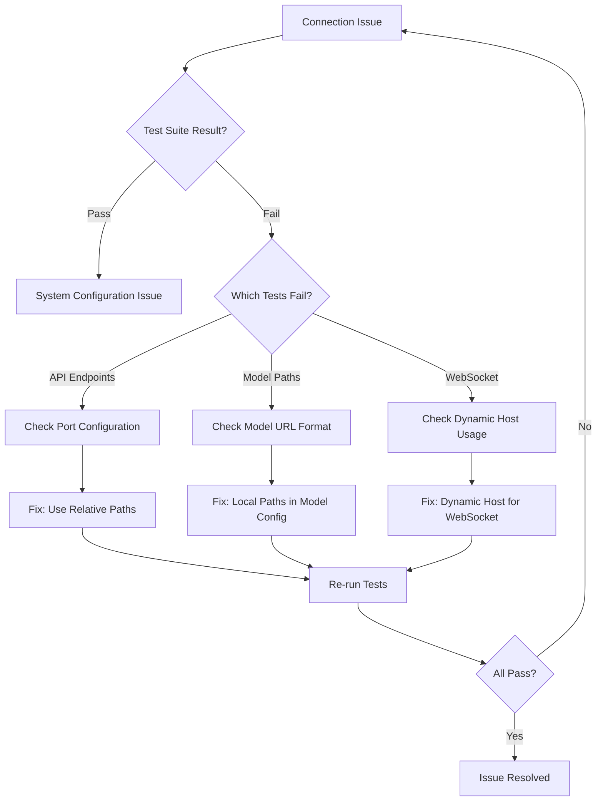

# Standard: Model Loading & Bridge Connectivity Testing Protocol

**Authority:** Active Standard | **Trigger:** Recurring Bridge/Model Loading Issues

## The Triangle of Pain

### 1. What Happened
The Ghost engine (headless browser) repeatedly had connection and model loading failures with the unified Anchor Core architecture. Issues included:
- WebSocket connection failures (hardcoded port 8080 vs 8000)
- Model loading failures due to incorrect URL construction
- API endpoint accessibility problems
- Multiple iterations required to fix configuration

### 2. The Cost
- 6+ hours across multiple debugging sessions
- Multiple failed attempts with different URL configuration approaches
- Confusion between Hugging Face URLs and local model paths
- Time lost to iterative fixing process

### 3. The Rule
- **Always test first:** Before debugging, run `test_model_loading.py` to identify which components fail
- **Use relative paths:** For same-server API calls (e.g., `/v1/gpu/status`)
- **Use dynamic host:** For WebSocket connections (`window.location.host`)
- **Model configuration:** Use local paths in `model` field, Hugging Face IDs in `model_id` field
- **Verify endpoints:** Use `model_test.html` to test endpoint accessibility interactively
- **Document changes:** Update `specs/standards/` when fixing similar issues

## Testing Protocol

### Pre-Deployment Checklist
1. Run `python tools/test_model_loading.py`
2. Verify WebSocket connection with `model_test.html`
3. Test model accessibility for all configured models
4. Confirm API endpoints respond correctly

### Troubleshooting Flow

### Test Files
- `tools/test_model_loading.py` - Command-line model loading test suite
- `tools/model_test.html` - Interactive browser-based testing interface
- Both verify endpoint accessibility and model path configuration