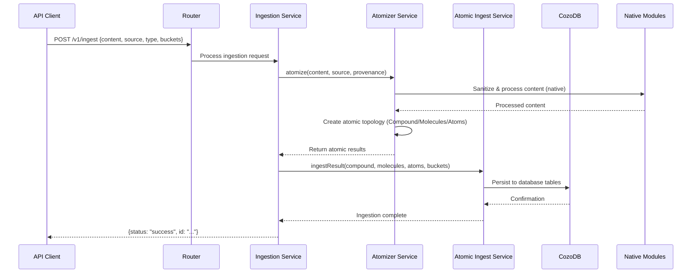
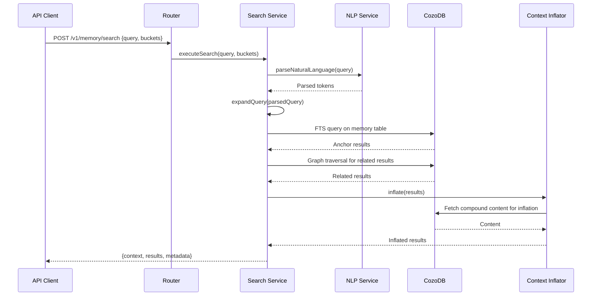
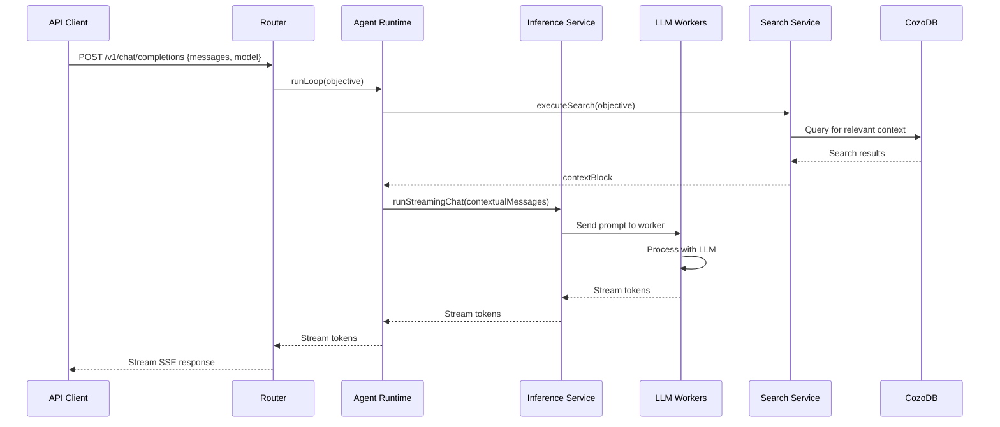
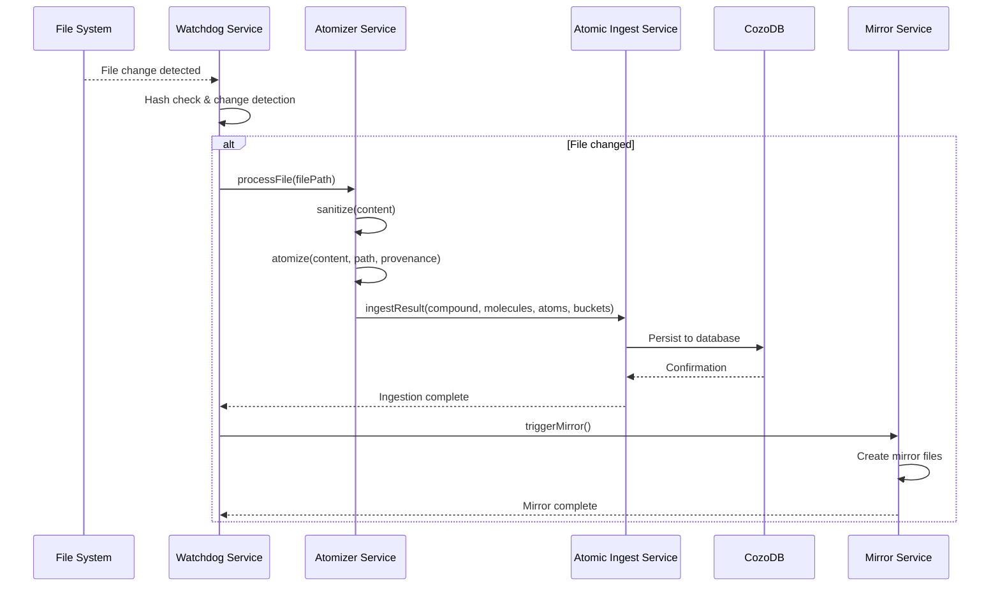
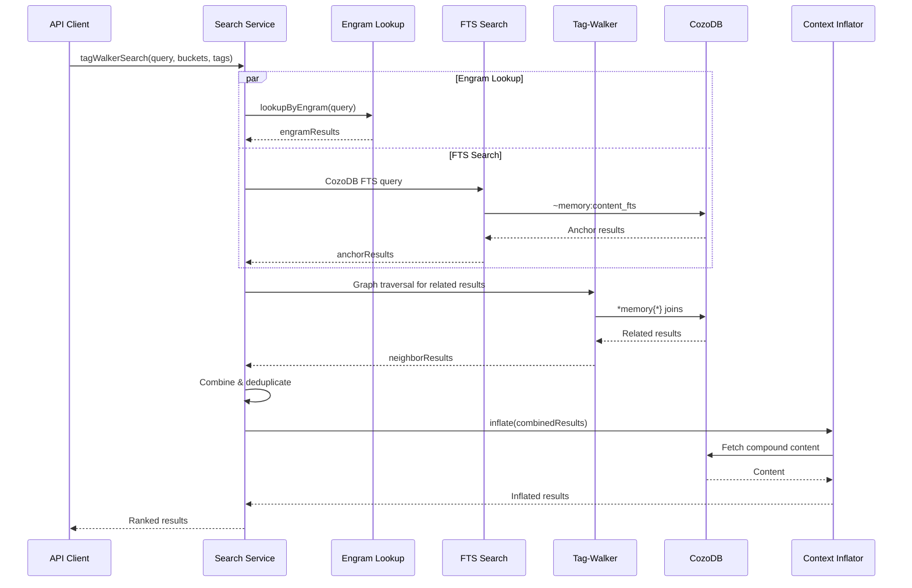

# ECE_Core API Flow Diagrams

## Ingestion API Flow

```mermaid
sequenceDiagram
    participant Client as API Client
    participant Router as Router
    participant IS as Ingestion Service
    participant AS as Atomizer Service
    participant AIS as Atomic Ingest Service
    participant DB as CozoDB
    participant NM as Native Modules
    
    Client->>Router: POST /v1/ingest {content, source, type, buckets}
    Router->>IS: Process ingestion request
    IS->>AS: atomize(content, source, provenance)
    AS->>NM: Sanitize & process content (native)
    NM-->>AS: Processed content
    AS->>AS: Create atomic topology (Compound/Molecules/Atoms)
    AS-->>IS: Return atomic results
    IS->>AIS: ingestResult(compound, molecules, atoms, buckets)
    AIS->>DB: Persist to database tables
    DB-->>AIS: Confirmation
    AIS-->>IS: Ingestion complete
    IS-->>Client: {status: "success", id: "..."}
```

## Search API Flow

```mermaid
sequenceDiagram
    participant Client as API Client
    participant Router as Router
    participant SS as Search Service
    participant NLP as NLP Service
    participant DB as CozoDB
    participant CI as Context Inflator
    
    Client->>Router: POST /v1/memory/search {query, buckets}
    Router->>SS: executeSearch(query, buckets)
    SS->>NLP: parseNaturalLanguage(query)
    NLP-->>SS: Parsed tokens
    SS->>SS: expandQuery(parsedQuery)
    SS->>DB: FTS query on memory table
    DB-->>SS: Anchor results
    SS->>DB: Graph traversal for related results
    DB-->>SS: Related results
    SS->>CI: inflate(results)
    CI->>DB: Fetch compound content for inflation
    DB-->>CI: Content
    CI-->>SS: Inflated results
    SS-->>Client: {context, results, metadata}
```

## Chat API Flow

```mermaid
sequenceDiagram
    participant Client as API Client
    participant Router as Router
    participant AR as Agent Runtime
    participant IS as Inference Service
    participant LW as LLM Workers
    participant SS as Search Service
    participant DB as CozoDB
    
    Client->>Router: POST /v1/chat/completions {messages, model}
    Router->>AR: runLoop(objective)
    AR->>SS: executeSearch(objective)
    SS->>DB: Query for relevant context
    DB-->>SS: Search results
    SS-->>AR: contextBlock
    AR->>IS: runStreamingChat(contextualMessages)
    IS->>LW: Send prompt to worker
    LW->>LW: Process with LLM
    LW-->>IS: Stream tokens
    IS-->>AR: Stream tokens
    AR-->>Router: Stream tokens
    Router-->>Client: Stream SSE response
```

## File Watch Ingestion Flow

```mermaid
sequenceDiagram
    participant FS as File System
    participant WD as Watchdog Service
    participant AS as Atomizer Service
    participant AIS as Atomic Ingest Service
    participant DB as CozoDB
    participant MS as Mirror Service
    
    FS-->>WD: File change detected
    WD->>WD: Hash check & change detection
    alt File changed
        WD->>AS: processFile(filePath)
        AS->>AS: sanitize(content)
        AS->>AS: atomize(content, path, provenance)
        AS->>AIS: ingestResult(compound, molecules, atoms, buckets)
        AIS->>DB: Persist to database
        DB-->>AIS: Confirmation
        AIS-->>WD: Ingestion complete
        WD->>MS: triggerMirror()
        MS->>MS: Create mirror files
        MS-->>WD: Mirror complete
    end
```

## Tag-Walker Search Flow

```mermaid
sequenceDiagram
    participant Client as API Client
    participant SS as Search Service
    participant EL as Engram Lookup
    participant FTS as FTS Search
    participant TW as Tag-Walker
    participant DB as CozoDB
    participant CI as Context Inflator
    
    Client->>SS: tagWalkerSearch(query, buckets, tags)
    
    par Engram Lookup
        SS->>EL: lookupByEngram(query)
        EL-->>SS: engramResults
    and FTS Search
        SS->>FTS: CozoDB FTS query
        FTS->>DB: ~memory:content_fts
        DB-->>FTS: Anchor results
        FTS-->>SS: anchorResults
    end
    
    SS->>TW: Graph traversal for related results
    TW->>DB: *memory{*} joins
    DB-->>TW: Related results
    TW-->>SS: neighborResults
    
    SS->>SS: Combine & deduplicate
    SS->>CI: inflate(combinedResults)
    CI->>DB: Fetch compound content
    DB-->>CI: Content
    CI-->>SS: Inflated results
    SS-->>Client: Ranked results
```