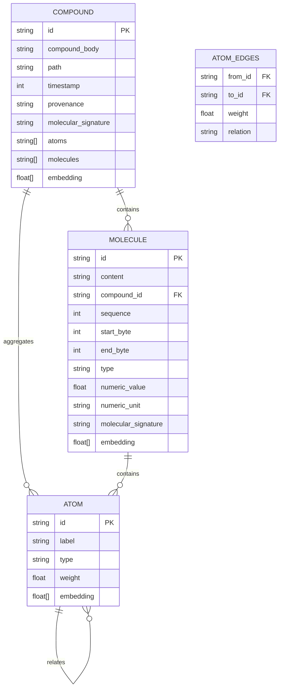

# Atomic Taxonomy Data Flow

## From Raw Content to Atomic Topology

```mermaid
flowchart TD
    A[Raw Content<br/>Text File, Code, etc.] --> B{Content Type}
    
    B -->|Prose| C[Prose Processing<br/>Sentence Splitting]
    B -->|Code| D[Code Processing<br/>AST-based Splitting]
    B -->|Data| E[Data Processing<br/>Row/Line Splitting]
    
    C --> F[Sanitization<br/>Key Assassin Protocol]
    D --> F
    E --> F
    
    F --> G[Semantic Analysis<br/>Entity Extraction]
    G --> H[Semantic Categorization<br/>Relationship/Narrative/Technical Tags]
    
    H --> I[Compound Creation<br/>ID: comp_[hash of content+path]<br/>Contains full content])
    I --> J[Molecule Extraction<br/>Semantic Segments<br/>with byte coordinates]
    
    J --> K[Molecule 1<br/>ID: mol_[hash]<br/>Content: [segment text]<br/>Start: [byte offset]<br/>End: [byte offset]<br/>Type: prose/code/data<br/>Sequence: 0]
    
    J --> L[Molecule 2<br/>ID: mol_[hash]<br/>Content: [segment text]<br/>Start: [byte offset]<br/>End: [byte offset]<br/>Type: prose/code/data<br/>Sequence: 1]
    
    J --> M[Other Molecules<br/>...]
    
    G --> N[System Atoms<br/>#project, #src, #code, etc.]
    H --> O[Semantic Atoms<br/>#Relationship, #Narrative, etc.]
    K --> P[K-Molecule Atoms<br/>Specific entities in segment]
    L --> Q[L-Molecule Atoms<br/>Specific entities in segment]
    M --> R[Other Molecule Atoms<br/>...]
    
    I --> S[Compound Atoms<br/>Aggregated from all molecules]
    I --> T[Compound Molecules<br/>IDs of all molecules]
    
    K --> U[Molecule-Compound Link<br/>compoundId reference]
    L --> U
    M --> U
    
    N --> V[Atom Deduplication<br/>Remove duplicates across system])
    O --> V
    P --> V
    Q --> V
    R --> V
    
    V --> W[Final Atoms<br/>Unique atom IDs with labels])
    
    I --> X{Persist to Database}
    K --> X
    L --> X
    M --> X
    W --> X
    
    X --> Y[CozoDB Tables:<br/>- compounds table<br/>- molecules table<br/>- atoms table<br/>- atom_edges table]
```

## Database Schema Relationships



## Processing Flow Example

```
Input: A Markdown file with code snippets and prose

1. Raw Content: "Project ECE_Core
   This system uses CozoDB for storage.
   ```typescript
   const db = new CozoDB();
   ```
   The database provides..."

2. Sanitization: Removes log artifacts, JSON wrappers, etc.

3. Compound Created:
   - ID: comp_a1b2c3d4
   - Path: /notebook/projects/ece_core.md
   - Content: Full sanitized text
   - Atoms: [#project:ECE_Core, #code, #database]
   - Molecules: [mol_1, mol_2, mol_3]

4. Molecules Created:
   - mol_1: "Project ECE_Core" (prose, bytes 0-17, seq 0)
     Atoms: [#project:ECE_Core]
   - mol_2: "```typescript..." (code, bytes 18-50, seq 1)
     Atoms: [#code, #typescript]
   - mol_3: "The database provides..." (prose, bytes 51-75, seq 2)
     Atoms: [#database]

5. Atoms Created:
   - atom_proj: "#project:ECE_Core" (system)
   - atom_code: "#code" (system)
   - atom_ts: "#typescript" (concept)
   - atom_db: "#database" (concept)

6. Relations Established:
   - comp_a1b2c3d4 -> mol_1, mol_2, mol_3
   - comp_a1b2c3d4 -> atom_proj, atom_code, atom_db
   - mol_1 -> atom_proj
   - mol_2 -> atom_code, atom_ts
   - mol_3 -> atom_db
```