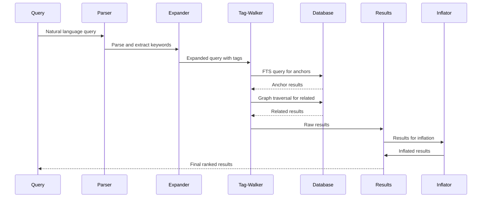
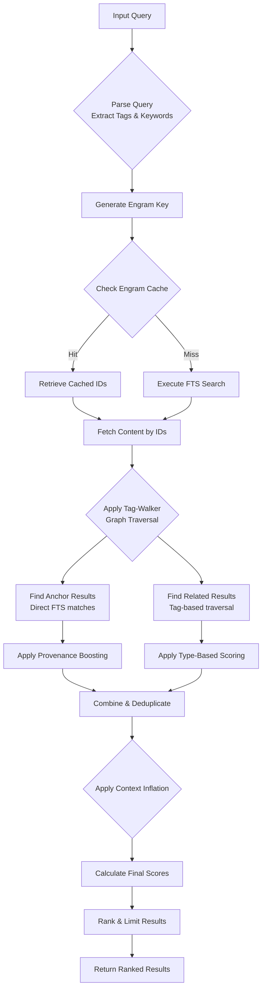
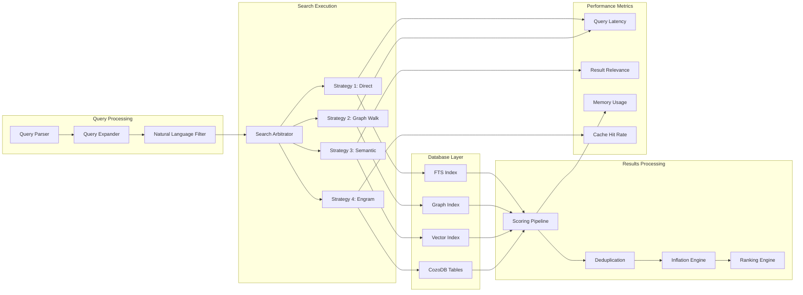

# ECE_Core Search Architecture - Tag-Walker Protocol

## Overview of Search Architecture

```mermaid
graph TB
    subgraph "Query Input"
        Q[Natural Language Query]
        PT[Parse & Tokenize]
        NL[NLP Processing]
        QE[Query Expansion]
    end
    
    subgraph "Search Strategies"
        EN[Engram Lookup<br/>O(1) Access]
        TW[Tag-Walker<br/>Graph Traversal]
        FTS[Full-Text Search<br/>CozoDB FTS]
        SM[Semantic Match<br/>Category Detection]
    end
    
    subgraph "Database Queries"
        QRY1[FTS Query<br/>~memory:content_fts]
        QRY2[Graph Query<br/>*memory{*} joins]
        QRY3[Engram Query<br/>*engrams{*}]
        QRY4[Semantic Query<br/>Category filters]
    end
    
    subgraph "Database Tables"
        MEM[(memory table<br/>Main storage)]
        MOL[(molecules table<br/>Molecular coords)]
        ATOM[(atoms table<br/>Semantic units)]
        EDGE[(atom_edges table<br/>Relationships)]
        ENG[(engrams table<br/>Lexical sidecar)]
    end
    
    subgraph "Results Processing"
        FIL[Filter & Dedupe]
        SCO[Score & Rank]
        INFL[Context Inflation]
        MERGE[Merge Results]
    end
    
    subgraph "Output"
        RES[Ranked Results]
        CON[Context Assembly]
        API[API Response]
    end
    
    Q --> PT
    PT --> NL
    NL --> QE
    
    QE --> EN
    QE --> TW
    QE --> FTS
    QE --> SM
    
    EN --> QRY3
    TW --> QRY2
    FTS --> QRY1
    SM --> QRY4
    
    QRY1 --> MEM
    QRY2 --> MEM
    QRY2 --> MOL
    QRY2 --> ATOM
    QRY2 --> EDGE
    QRY3 --> ENG
    QRY4 --> MEM
    
    MEM --> FIL
    MOL --> FIL
    ATOM --> FIL
    ENG --> FIL
    
    FIL --> SCO
    SCO --> INFL
    INFL --> MERGE
    MERGE --> RES
    RES --> CON
    CON --> API
```

## Tag-Walker Protocol Flow



## Detailed Tag-Walker Algorithm



## Search Performance Architecture



## CozoDB Query Patterns

```mermaid
graph TD
    subgraph "FTS Query Pattern"
        FQ[~memory:content_fts{id | query: $query, k: 50, bind_score: fts_score}]
        FM[*memory{id, content, source, timestamp, buckets, tags, epochs, provenance, simhash}]
    end
    
    subgraph "Graph Walk Pattern"
        GQ[*memory{id: anchor_id, tags: anchor_tags}, anchor_id in $anchorIds]
        GT[tag in anchor_tags, *memory{id, content, source, timestamp, buckets, tags, epochs, provenance, sequence, simhash, type}]
        GF[tag in tags, id != anchor_id]
    end
    
    subgraph "Join Pattern"
        JP[*molecules{id, start_byte, end_byte, type, numeric_value, numeric_unit, compound_id}]
    end
    
    FQ --> FM
    GQ --> GT
    GT --> GF
    FM --> JP
    GT --> JP
```