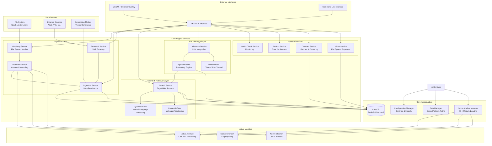
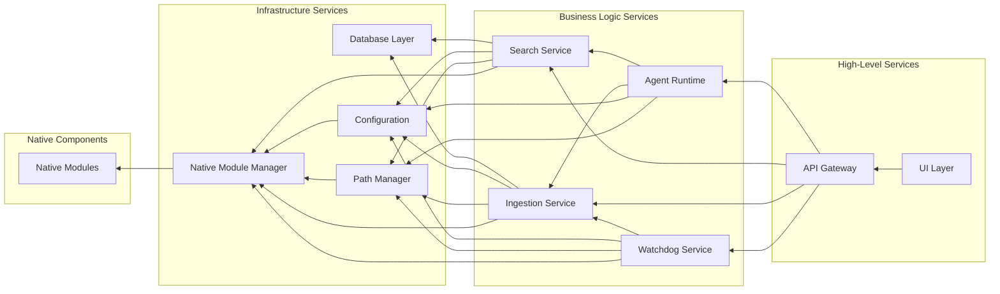

# ECE_Core System Components

## Component Architecture

```mermaid
graph TB
    subgraph "External Interfaces"
        UI[Web UI / Electron Overlay]
        API[REST API Interface]
        CLI[Command Line Interface]
    end
    
    subgraph "Core Engine Services"
        subgraph "Ingestion Layer"
            WD[Watchdog Service<br/>File System Monitor]
            AS[Atomizer Service<br/>Content Processing]
            IS[Ingestion Service<br/>Data Persistence]
            RS[Research Service<br/>Web Scraping]
        end
        
        subgraph "Search & Retrieval Layer"
            SS[Search Service<br/>Tag-Walker Protocol]
            CI[Context Inflator<br/>Molecular Windowing]
            QS[Query Service<br/>Natural Language Processing]
        end
        
        subgraph "AI & Inference Layer"
            INF[Inference Service<br/>LLM Integration]
            AG[Agent Runtime<br/>Reasoning Engine]
            LW[LLM Workers<br/>Chat & Side Channel]
        end
        
        subgraph "System Services"
            HC[Health Check Service<br/>Monitoring]
            BS[Backup Service<br/>Data Persistence]
            DM[Dreamer Service<br/>Historian & Clustering]
            MS[Mirror Service<br/>File System Projection]
        end
    end
    
    subgraph "Core Infrastructure"
        CFG[Configuration Manager<br/>Settings & Models]
        PM[Path Manager<br/>Cross-Platform Paths]
        NMM[Native Module Manager<br/>C++ Module Loading]
        DB[(CozoDB<br/>RocksDB Backend)]
    end
    
    subgraph "Native Modules"
        NM[Native Atomizer<br/>C++ Text Processing]
        NS[Native SimHash<br/>Fingerprinting]
        NC[Native Cleaner<br/>JSON Artifacts]
    end
    
    subgraph "Data Sources"
        FS[File System<br/>Notebook Directory]
        EXT[External Sources<br/>Web APIs, etc.]
        EMB[Embedding Models<br/>Vector Generation]
    end
    
    %% API Connections
    UI --> API
    CLI --> API
    
    %% Ingestion Flow
    API --> WD
    API --> IS
    API --> RS
    WD --> AS
    AS --> IS
    AS --> NM
    IS --> DB
    RS --> IS
    
    %% Search Flow
    API --> SS
    SS --> QS
    SS --> CI
    SS --> DB
    
    %% Inference Flow
    API --> INF
    INF --> AG
    INF --> LW
    AG --> SS
    AG --> DB
    
    %% System Services
    API --> HC
    API --> BS
    API --> DM
    API --> MS
    
    %% Infrastructure Connections
    AllServices --> CFG
    AllServices --> PM
    AllServices --> NMM
    IS --> DB
    SS --> DB
    DM --> DB
    MS --> DB
    
    %% Native Module Connections
    NMM --> NM
    NMM --> NS
    NMM --> NC
    AS --> NS
    AS --> NC
    
    %% Data Sources
    FS --> WD
    EXT --> RS
    EMB --> IS
```

## Service Dependencies

```mermaid
graph RL
    subgraph "High-Level Services"
        UI[UI Layer]
        API[API Gateway]
    end
    
    subgraph "Business Logic Services"
        AG[Agent Runtime]
        SS[Search Service]
        IS[Ingestion Service]
        WD[Watchdog Service]
    end
    
    subgraph "Infrastructure Services"
        DB[Database Layer]
        NMM[Native Module Manager]
        CFG[Configuration]
        PM[Path Manager]
    end
    
    subgraph "Native Components"
        NM[Native Modules]
    end
    
    UI --> API
    API --> AG
    API --> SS
    API --> IS
    API --> WD
    
    AG --> SS
    AG --> IS
    SS --> DB
    IS --> DB
    WD --> IS
    
    AG --> CFG
    AG --> PM
    SS --> CFG
    SS --> PM
    IS --> CFG
    IS --> PM
    WD --> CFG
    WD --> PM
    
    CFG --> NMM
    PM --> NMM
    IS --> NMM
    SS --> NMM
    WD --> NMM
    
    NMM --> NM
```

## API Endpoint Mapping

```mermaid
graph TD
    API_ROOT[API Root<br/>http://localhost:3000]
    
    subgraph "Ingestion Endpoints"
        IE1[POST /v1/ingest<br/>Content Ingestion]
        IE2[POST /v1/research/scrape<br/>Web Scraping]
    end
    
    subgraph "Search Endpoints"
        SE1[POST /v1/memory/search<br/>Standard Search]
        SE2[POST /v1/memory/molecule-search<br/>Molecule Search]
        SE3[GET /v1/buckets<br/>Get Buckets]
        SE4[GET /v1/tags<br/>Get Tags]
    end
    
    subgraph "Semantic Endpoints"
        SSE1[POST /v1/semantic/search<br/>Semantic Search]
        SSE2[POST /v1/atoms/quarantine<br/>Quarantine Atom]
        SSE3[POST /v1/atoms/restore<br/>Restore Atom]
    end
    
    subgraph "System Endpoints"
        SYS1[GET /health<br/>Health Check]
        SYS2[POST /v1/backup<br/>Create Backup]
        SYS3[GET /v1/backup<br/>Download Backup]
        SYS4[POST /v1/dream<br/>Trigger Dreamer]
    end
    
    subgraph "AI Endpoints"
        AI1[POST /v1/chat/completions<br/>Chat Interface]
        AI2[GET /v1/models<br/>List Models]
        AI3[POST /v1/inference/load<br/>Load Model]
    end
    
    API_ROOT --> IE1
    API_ROOT --> IE2
    API_ROOT --> SE1
    API_ROOT --> SE2
    API_ROOT --> SE3
    API_ROOT --> SE4
    API_ROOT --> SSE1
    API_ROOT --> SSE2
    API_ROOT --> SSE3
    API_ROOT --> SYS1
    API_ROOT --> SYS2
    API_ROOT --> SYS3
    API_ROOT --> SYS4
    API_ROOT --> AI1
    API_ROOT --> AI2
    API_ROOT --> AI3
```