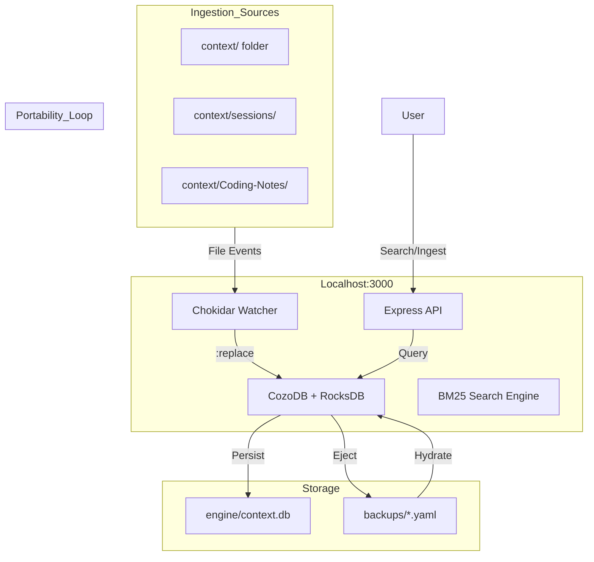

# Anchor Core: The Visual Monolith (v4.0)

**Status:** Node.js Monolith + CozoDB (RocksDB) + Snapshot Portability | **Philosophy:** Database as Source of Truth, Resource-Queued.

## 1. The Anchor Architecture
The **Anchor Core** is now a Node.js Monolith (`engine/src/index.js`). It integrates the API, File Watcher, and CozoDB (RocksDB) into a single process.

## 2. Memory Lifecycle (Standard 037)
The system follows a "Docker-style" build-and-ship workflow:
1. **Ingest**: Watcher indexes local files into CozoDB.
2. **Eject**: Export DB state to a portable YAML Snapshot.
3. **Ship**: Move the YAML Snapshot to any machine.
4. **Hydrate**: Restore the DB state instantly from the Snapshot.

## 3. Port Map

* **3000**: **The One Port.** Serves UI, API, and Database operations.

## 4. Search Architecture

* **BM25 FTS**: Native CozoDB Full Text Search with relevance scoring.
* **Truncation**: Large search results are automatically truncated to prevent API overflows.

## 5. Legacy Architecture (Archived)

* **Ghost Engine**: The previous browser-based WASM engine (Archived in `archive/v3_legacy`).
* **Python Bridge**: The FastAPI-based bridge for local file access (Archived).
* **No Resurrection Mode**: Legacy flags for controlling browser auto-launch.
* **read_all.py**: Previous Python-based context aggregation script.

---
*End of Specification*
