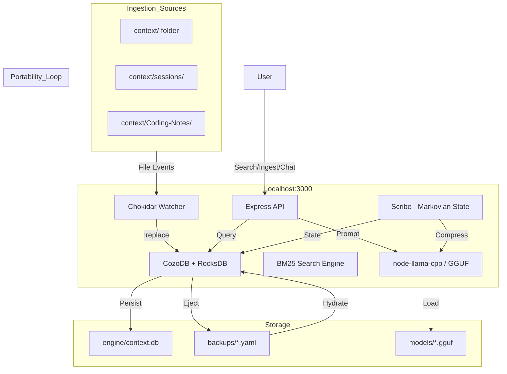
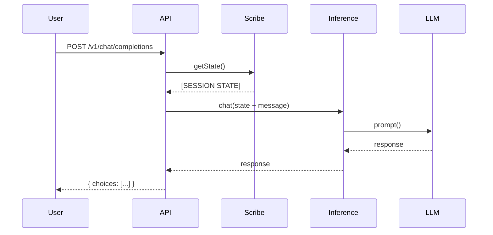

# Anchor Core: The Visual Monolith (v4.1)

**Status:** Node.js Monolith + CozoDB (RocksDB) + Local Inference + Markovian Reasoning
**Philosophy:** Database as Source of Truth, Context Weaving, Stateless Portability.

## 1. System Architecture



## 2. Core Services

| Service | File | Purpose |
|---------|------|---------|
| **Express API** | `src/index.js` | HTTP server, routes, static files |
| **CozoDB** | `src/core/db.js` | RocksDB-backed graph database |
| **Inference** | `src/services/inference.js` | Local LLM via `node-llama-cpp` |
| **Scribe** | `src/services/scribe.js` | Markovian rolling context |
| **Dreamer** | `src/services/dreamer.js` | Background memory organization |
| **Search** | `src/services/search.js` | BM25 FTS with bucket filtering |
| **Watcher** | `src/services/watcher.js` | File system ingestion |

## 3. Memory Schema (Standard 039)

```
memory {
  id: String (PK)
  timestamp: Int
  content: String
  source: String
  type: String
  hash: String
  buckets: [String]  // Multi-category support
}
```

## 4. Context Weaving (Standard 041)



## 5. API Reference

### Memory Operations
| Endpoint | Method | Purpose |
|----------|--------|---------|
| `/v1/ingest` | POST | Ingest content with buckets |
| `/v1/memory/search` | POST | BM25 search with bucket filter |
| `/v1/buckets` | GET | List all buckets |
| `/v1/backup` | GET | Export YAML snapshot |

### Inference Operations
| Endpoint | Method | Purpose |
|----------|--------|---------|
| `/v1/models` | GET | List available GGUF models |
| `/v1/inference/load` | POST | Load model with context size |
| `/v1/inference/status` | GET | Current model status |
| `/v1/chat/completions` | POST | Chat with Context Weaving |

### Scribe (Markovian State)
| Endpoint | Method | Purpose |
|----------|--------|---------|
| `/v1/scribe/update` | POST | Update rolling state from history |
| `/v1/scribe/state` | GET | Get current session state |
| `/v1/scribe/state` | DELETE | Clear session state |

### System
| Endpoint | Method | Purpose |
|----------|--------|---------|
| `/health` | GET | Health check |
| `/v1/dream` | POST | Trigger Dreamer organization |

## 6. Portability Lifecycle

```
1. INGEST  → Watcher indexes files into CozoDB
2. EJECT   → GET /v1/backup exports YAML snapshot
3. SHIP    → Copy YAML to new machine
4. HYDRATE → node src/hydrate.js restores state
```

## 7. Standards Reference

| ID | Name | Summary |
|----|------|---------|
| 037 | Snapshot Portability | Eject/Hydrate workflow |
| 038 | Cortex Upgrade | node-llama-cpp integration |
| 039 | Multi-Bucket Schema | `buckets: [String]` support |
| 040 | Cozo Syntax Compliance | List query patterns |
| 041 | Markovian Reasoning | Scribe + Context Weaving |

---
*End of Specification*
